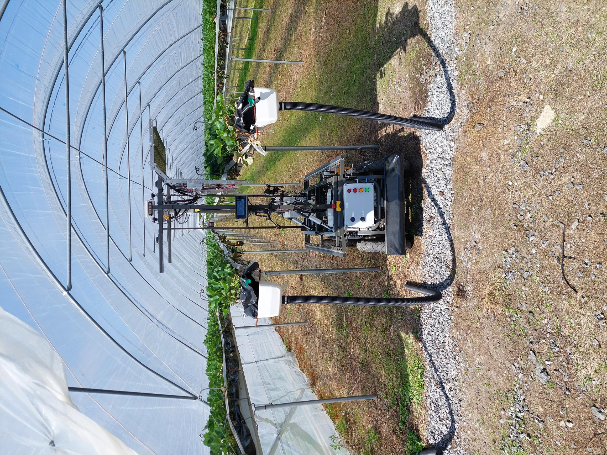

# robosoft_aki

AKI is a complete example of a robot application built with RoboSoft. It shows
how generic core nodes, RoboSoft interfaces, [ROS2ISOBUS][ros2isobus]
communication and
machine-specific adapters can be assembled into an independently deployable
control stack.

This package depends on `robosoft_core` and `robosoft_interfaces`, but not on
any other RoboSoft example application. Its CAN protocols, state guards,
remote mapping, UVC sequence and launch configuration are specific to AKI.



*AKI is an electric research platform for autonomous work in tunnels and
greenhouses. RoboSoft coordinates its navigation, safety and UVC treatment
functions.*

## Overview

- **AKI main state machine**: two-stage initialization, physical-remote mode
  selection, TASK coordination and subsystem health. Docs:
  [src/aki_main/README.md](src/aki_main/README.md)
- **Physical remote controller**: proprietary radio-remote CAN decoding and
  standard Joy observation. Docs:
  [src/remote_controller/README.md](src/remote_controller/README.md)
- **UVC and LED controller**: proprietary UVC/camera-light CAN command and
  feedback protocol. Docs: [src/uvc_led/README.md](src/uvc_led/README.md)
- **UVC motion sequence**: treatment stop, completion wait, advance and final
  motion-command ownership. Docs:
  [src/uvc_sequence/README.md](src/uvc_sequence/README.md)

Shared GNSS, localization, TASK, navigation, GUI and lidar-safety components
are documented in [`robosoft_core`](../robosoft_core/README.md). ROS2ISOBUS
owns CAN transport, address claiming and TECU/NMEA 2000 interfaces.

## Hardware interfaces

- **CAN:** ISO 11783-compatible communication. T-ECU Class 3 messages carry
  speed and steering commands, and NMEA 2000 positioning messages are
  transmitted on the bus.
- **RS-232:** NMEA 0183 GNSS data and correction data supplied by the NTRIP
  client use the serial connection.

## Nodes

| Node | Responsibility |
| --- | --- |
| [`aki_main_node`](src/aki_main/README.md) | Top-level operating state and safety coordinator |
| [`remote_controller_node`](src/remote_controller/README.md) | Physical radio-remote decoder |
| [`uvc_led_node`](src/uvc_led/README.md) | UVC/camera-light CAN protocol adapter |
| [`aki_uvc_sequence_node`](src/uvc_sequence/README.md) | Treatment sequence and final automatic motion command |

AKI driving mode is selected only with the physical remote. Once the remote is
in AUTO, GUI START supplies the same start authorization as the physical
remote's start-plus-deadman combination. The remote must remain connected with
its emergency-stop/safety circuit OK.

## Architecture and integration

The launch file starts ROS2ISOBUS, `robosoft_core` GNSS and shared positioning,
TaskManager and RouteControl nodes together with the AKI state machine and
remote decoder.

The shared `robosoft_core` RouteControl and selectable PathTracking
implementations provide TASK recording, geometric following and guarded
velocity commands. `aki_uvc_sequence_node` coordinates AKI treatment stops and is the
single final command publisher remapped to ROS2ISOBUS TECU Class 3.
RouteControl is the sole publisher of the latched active route on
`/route_control/current_route` and its standard `nav_msgs/Path` representation
on `/route_control/active_path`. The complete guidance group used by the GUI is
published separately on `/route_control/path`.

### Replacing the native path controller with Nav2

AKI can use either the generic `path_tracking_simple_node` or the
VIATOC-generated `path_tracking_nmpc_node` for route tracking, TASK point-speed
handling, reverse driving and lidar speed limits. Select the implementation
with `path_tracking_algorithm:=simple|nmpc`; `nmpc` is the default. Both run
under the stable `/path_tracking_node` graph name. The
AKI-specific `aki_uvc_sequence_node` passes normal commands through and owns
the UVC stop/treat/advance sequence. Its final `geometry_msgs/TwistStamped`
output is remapped to the ROS2ISOBUS T-ECU Class 3 command interface. Nav2 is
not a package dependency and the standard AKI launch does
not start a Nav2 controller server. A downstream user may replace the native
path controller with Nav2 while retaining RouteControl and TASK management.

The available interfaces support the following user-provided integration:

```text
route_control/active_path (nav_msgs/Path, odom)
                    +
odometry (nav_msgs/Odometry) and odom -> base_link TF
                    |
          optional FollowPath adapter
                    |
          Nav2 controller_server
                    |
       geometry_msgs/TwistStamped
                    |
        ROS2ISOBUS T-ECU Class 3
```

The adapter sends each active path as a `nav2_msgs/action/FollowPath` goal. It
must not send `route_control/path`, because that visualization path
can contain multiple forward and reverse TASK patterns. RouteControl must
remain responsible for changing patterns and completing the task.

`nav_msgs/Path` contains poses only. Target speed, driving direction,
implement state and TASK identifiers remain available from
`route_control/current_route` and `route_control/status`. An integration must
combine these with the Nav2 curvature command and retain AKI's lidar and UVC
safety logic before publishing the final T-ECU command. Only one component may
publish the final autonomous command at a time; an alternative controller
must feed the AKI UVC coordinator or replace the complete command chain.

At an AKI UVC route section, the UVC coordinator stops at each treatment position,
starts the hardware-managed sequence and waits for its active-to-complete
feedback. It then advances the configured `uvc_advance_distance_m` before
starting the next sequence. Leaving the UVC route section
returns to continuous route following.

## Starting the application

AKI provides three entry points for different deployment arrangements:

| Entry point | Purpose |
| --- | --- |
| `ros2 launch robosoft_aki aki_nodes.launch.py` | Starts the control stack when the GUI and SICK lidar driver are managed separately or are not required |
| `./start_aki_gui.sh` | Starts the GUI, SICK driver and control stack on a development computer using physical or virtual interfaces |
| `./start_aki_epec.sh` | Starts the complete application on the Epec 6807 embedded deployment |

The shell scripts are convenience orchestration layers around the ROS 2
launch files. Start only the control stack with:

```bash
ros2 launch robosoft_aki aki_nodes.launch.py
```

For normal workstation operation, run the repository-level script instead:

```bash
./start_aki_gui.sh physical
```

The official SICK `sick_scan_xd` ROS 2 driver provides the point cloud. The
workspace startup script launches the TiM5xx configuration with the configured
default sensor address `192.168.1.160`. Override it when necessary:

```bash
SICK_LIDAR_HOSTNAME=192.168.1.161 ./start_aki_gui.sh
```

For a virtual-CAN simulation, pass the interface to the same script:

```bash
./start_aki_gui.sh virtual vcan0
```

In `virtual` mode the script starts the SICK driver against the Ethernet
simulator and uses the simulator T-ECU identity (`01006007008600A0`, address 240). It
also creates a virtual GNSS serial pair with `socat` and gives
`/tmp/aki_gnss_robot` to the generic serial node. The simulator writes NMEA
0183 data to the other endpoint, `/tmp/aki_gnss_sim`. Lidar is enabled by default.
Set `START_SICK_LIDAR=false` to run without lidar safety and measurements.
With `virtual`, this starts the real SICK driver against the simulator at
`127.0.0.1:2112` and enables lidar processing. For separate computers, set
`SICK_LIDAR_HOSTNAME` to the simulator computer's IP address. See the
[generic Ethernet lidar simulator](../robosoft_simulator/src/sick_tim5xx_simulator/README.md)
and its [TASK cloud source](../robosoft_simulator/src/task_lidar_cloud_generator/README.md).

The underlying launch argument is `enable_lidar`. It defaults to `true` for
physical operation and can be overridden explicitly when needed:

```bash
./start_aki_gui.sh virtual vcan0 enable_lidar:=true
```

Start the virtual simulator in another terminal and the AKI controller with:

```bash
./start_aki_simulator.sh virtual
./start_aki_gui.sh virtual
```

Physical hardware is the default, so the following are equivalent:

```bash
./start_aki_gui.sh
./start_aki_gui.sh physical can0
```

### EPEC 6807 embedded deployment

The AKI control software and Qt operator interface have been deployed on an
[Epec 6807 Display Unit](https://epec.fi/epec-oy-products/displays/display-unit-6807/).
RoboSoft runs inside a Docker container on the embedded Linux display. The
host system must configure and start `can0` before the application container
is started. Then use the dedicated launcher inside the container:

```bash
./start_aki_epec.sh
```

The script starts the GUI, lidar driver and AKI nodes using the embedded
installation and TASK directory. ROS launch arguments can be appended, for
example `./start_aki_epec.sh serial_device:=/dev/ttyS1`. The script itself
documents its environment overrides, installation discovery, TASK seeding and
shutdown behaviour.

This deployment is a working reference integration rather than a generic
prebuilt container image. For additional build, container or EPEC integration
details, contact juha.backman@luke.fi.

The shared `robosoft_core/lidar_safety_node` subscribes `/cloud`. PathTracking sends only stop commands
until healthy lidar status is available, and returns to stop if the cloud or
safety status times out.

Motion and UVC control must be tested first with a simulated CAN bus and then
on hardware under the machine-specific safety procedure.

The GNSS package publishes orientation and acceleration as
`sensor_msgs/Imu` on `/gnss/imu`, and ground speed as
`geometry_msgs/TwistStamped` on `/gnss/velocity`. The launch file remaps these
generic topics to the ROS2ISOBUS NMEA2000Server inputs. The server sends no
corresponding NMEA 2000 measurement while its input topic is silent.

Treatment stops can be bypassed without editing the TASK file:

```bash
ros2 launch robosoft_aki aki_nodes.launch.py enable_uvc_sequence:=false
```

With the workspace startup script, use:

```bash
./start_aki_gui.sh virtual enable_uvc_sequence:=false
```

The launch-owned `base_link -> lidar_link` transform is the controller's
single lidar-mount definition. The SICK driver publishes the cloud in
`lidar_link`; localization and safety transform it to `base_link` through
TF2. The startup scripts disable the SICK driver's own default 10 Hz TF output
to prevent a second, conflicting parent for `lidar_link`. All GNSS and lidar
static transforms can be overridden without changing source code, for example:

```bash
ros2 launch robosoft_aki aki_nodes.launch.py \
  lidar_x:=1.094 lidar_z:=0.35 gnss_x:=-0.20 gnss_z:=1.80
```

AKI's committed safety-corridor x-boundaries are expressed from `base_link`.
They include the default `1.094 m` longitudinal mount offset so their physical
clearances match the earlier sensor-relative configuration. After this
conversion the safety boundaries stay fixed to the vehicle when the lidar is
moved; update the TF mount transform (and the separate simulator sensor model),
not the vehicle safety geometry.

NTRIP is disabled in the committed configuration because credentials and
receiver device names are deployment-specific. Configure these locally and
set `ntrip_client_node.ros__parameters.enabled` to `true`; never commit live
caster credentials.

## Package structure

```text
robosoft_aki/
├── config/
│   └── aki_params.yaml
├── launch/
│   └── aki_nodes.launch.py
├── src/
│   ├── aki_main/
│   │   ├── README.md
│   │   ├── aki_main_node.cpp
│   │   └── aki_main_node.hpp
│   ├── uvc_sequence/
│   │   ├── README.md
│   │   ├── uvc_sequence_node.cpp
│   │   └── uvc_sequence_node.hpp
│   ├── uvc_led/
│   │   ├── README.md
│   │   ├── uvc_led_node.cpp
│   │   ├── uvc_led_node.hpp
│   │   └── uvc_led_protocol.hpp
│   └── remote_controller/
│       ├── README.md
│       ├── remote_controller_node.cpp
│       ├── remote_controller_node.hpp
│       └── remote_protocol.hpp
└── test/
    └── ...
```

## Validation status

The package builds and its automated tests exercise launch ownership, remote
and UVC protocol handling. Shared core tests cover route tracking, lidar
processing and localization. CAN addressing, actuator direction, safety inputs
and treatment timing still require controlled validation on the actual machine before
unrestricted operation.

## License

GPL-3.0-only. See `LICENSE`.

[ros2isobus]: https://github.com/AGRIForward/ROS2ISOBUS
