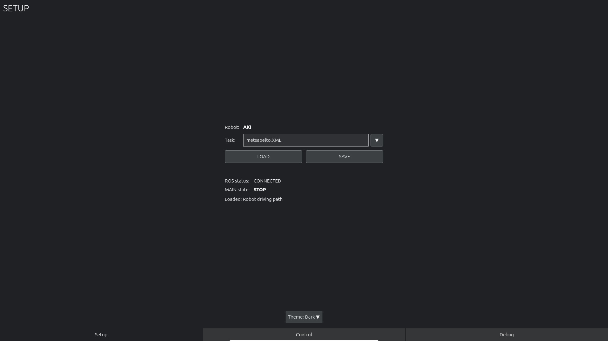
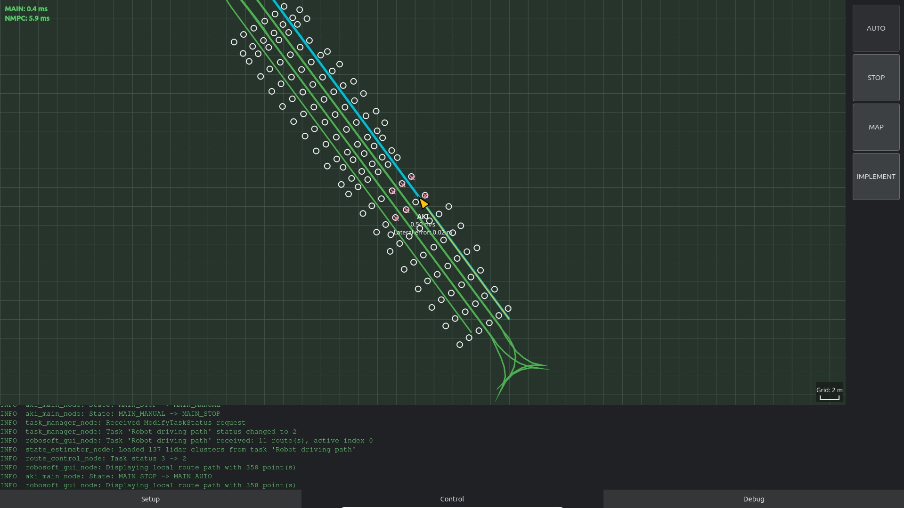
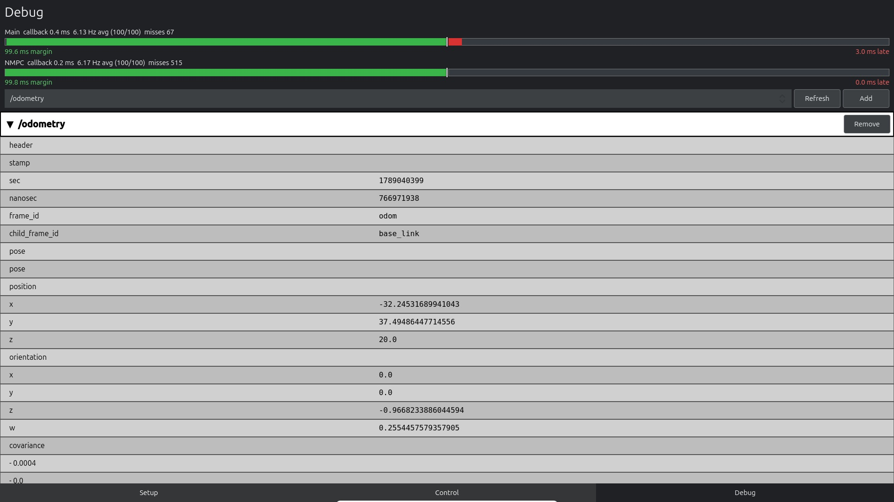

# RoboSoft GUI

Qt 6 and ROS 2 GUI for the RoboSoft robot control system.

## Component

| Node | Responsibility |
| --- | --- |
| `robosoft_gui_node` | Bridges ROS topics and task services to the Qt/QML operator interface |

## Local configuration

Application-specific GUI values are defined in a parameter file. A starting
configuration is available in
[`config/gui_params.yaml`](../../config/gui_params.yaml):

- `robot_name`: ROS robot identifier
- `robot_display_name`: name shown in the GUI
- `application_title`: window title
- `default_task_file`: local default task file
- `task_directory`: directory scanned for selectable `.xml` TASK files
- `gui_mode_selection_enabled`: allow MAN/AUTO selection from the GUI; disable
  it when operating-mode selection belongs to an external operator control

Start the GUI with the configuration:

```bash
ros2 launch robosoft_core gui.launch.py

# Application parameter overlay
ros2 launch robosoft_core gui.launch.py config_file:=/path/to/gui_params.yaml
```

## Features

### Architecture

```text
src/gui/                    (ROS 2 node bridge and application entry point)

resources/gui/
├── Main.qml               (3-page SwipeView application)
├── Page1Form.qml          (Setup: task handling and live initialization status)
├── Page2Form.qml          (Control: map visualization + buttons)
└── Page3Form.qml          (Debug: system diagnostics log)
```

### Threading model

```text
Main Thread: Qt Event Loop
  ├── QML rendering
  ├── Button clicks
  └── Property updates

Background Thread: ROS 2 Spin
  ├── rclcpp::spin() (blocking)
  ├── Topic subscriptions
  └── Service calls
```

### Pages

#### Page 1: Setup
- Robot identity read from the local configuration
- Task file input
- TASK-file selection menu populated from `task_directory`
- Load and save buttons
- Live ROS connection and robot main-state display
- Separate, automatically hidden rows for nodes and input messages still
  awaited during initialization
- Direct physical-keyboard task input on x86 builds and an on-screen keyboard
  popup on ARM builds
- Dark and light operator-selectable color themes

#### Page 2: Control
- Local metric route view with active route, vehicle history and heading
- Centered fixed-scale view by default, selectable AUTO fit view and manual zoom
- Robot name and speed below the live vehicle symbol
- TASK obstacles drawn as circles and associated lidar measurements as crosses.
  Markers use fixed pixel sizes and contrasting colours in both themes. Measurements
  are transformed from the rear-axle frame using the latest GUI odometry at
  reception (not timestamp-synchronized), and expire after one second without
  updates. Empty observations clear measurement markers immediately.
- Latest MAIN and NMPC callback execution times in the map's upper-left corner.
  Values below 80 ms are green, values from 80 through 100 ms are yellow and
  values above 100 ms are red.
- A red safety-stop warning below the execution times identifies a lidar stop,
  an emergency stop or both. A lidar stop includes an unavailable lidar and an
  obstacle that reduces the permitted speed to zero.
- MAN/AUTO toggle button
- START/STOP button
- E-STOP button (emergency)
- History ON records and draws the driven trace; OFF clears it and stops storage

#### Page 3: Debug
- Callback execution time, ten-second average callback frequency and live
  100 ms timing gauges for the robot main loop and NMPC controller. The
  green left-hand bar shows remaining callback margin; a delayed or overlong
  cycle grows a red lateness bar from the centre to the right.
- Configured robot identity and ROS topic monitor
- `/rosout` message log with color-coded levels
- User-selectable ROS topics grouped by package/category

## Screenshots

### Setup

The Setup page selects and saves TASK files and shows the ROS connection,
main-state-machine state and any startup dependencies still being awaited.



### Control

The Control page combines route, vehicle, lidar-landmark and driven-history
visualization with the application controls and runtime safety indications.



### Debug

The Debug page shows control-loop timing and allows arbitrary ROS topics to be
selected for structured inspection alongside runtime logging.



## Topics and services

### Subscriptions

- `/robot_state/status` (RobotState) - Robot operational state
- `/odometry` (`nav_msgs/Odometry`) - Position, heading and velocity
- `/robosoft/lidar/landmarks` (`geometry_msgs/PoseArray`) - Complete TASK
  obstacle map in the local odometry frame, reliable/transient-local
- `/robosoft/lidar/cluster_observations` (`LidarClusterObservationArray`) - Up
  to six associated lidar measurements used for X markers; no raw scans are
  subscribed by the GUI
- `/robosoft/lidar/safety_status` (`LidarSafetyStatus`) - Lidar health and the
  current obstacle-based speed limit used by the safety-stop warning
- `/route_control/path` (`nav_msgs/Path`) - Active TASK route already converted
  to the local metric frame by RouteControl
- `/route_control/active_path` (`nav_msgs/Path`) - Currently active route
  segment highlighted over the complete route
- `/route_control/status` (`robosoft_interfaces/RouteStatus`) - Local robot's
  lateral path-tracking error shown below its speed
- `/robots/<name>/odometry` (`nav_msgs/Odometry`) - Automatically discovered,
  read-only remote robot position, heading and velocity
- `/robots/<name>/path` (`nav_msgs/Path`) - Automatically discovered,
  read-only remote robot path

Remote odometry and paths must use the same local metric coordinate frame as
the local `/odometry`. The future EFDI adapter is responsible for this mapping.
Remote topics are never used as command targets.

- `/rosout` (rcl_interfaces/Log) - System messages
- `/task_manager/task_loaded` (TaskData) - Loaded task data

The GUI does not convert WGS84 coordinates and has no latitude/longitude
origin parameters. It draws the local path supplied by RouteControl.

### Publications

- `/robot_command` (RobotCommand) - Control commands (speed, steering, mode)

### Services

- `/task_manager/select_task` (SelectTask) - Load task file
- `/task_manager/save_task` (SaveTask) - Save task file

## GUI node class

### Q_INVOKABLE methods (callable from QML)

```cpp
selectTask(QString task_name)
saveTask(QString task_name)
setRobotMode(uint8_t mode)           // 0=manual, 1=auto
publishCommand(float speed, float steering, uint8_t implement)
startAutonomous()
stopAutonomous()
emergencyStop()
startRecording()
stopRecording()
selectGuidance(int index)
setImplementMode(uint8_t mode)

// Status queries
getRobotName()
getRobotDisplayName()
getApplicationTitle()
getDefaultTaskFile()
getCurrentState()
getLastError()
```

### Q_SIGNALS (emitted to QML)

```cpp
robotStateChanged(QString state, QString substate)
robotModeChanged(bool automatic)
taskLoaded(QString task_name)
taskSaved(QString filepath)
odometryUpdated(float x, float y, float heading, float velocity)
timerFrequencyUpdated(QString component, float average_hz, float target_hz,
                      int sample_count)
safetyStopChanged(bool lidar_stop, bool emergency_stop)
remoteOdometryUpdated(QString name, float x, float y, float heading,
                      float velocity)
remotePathUpdated(QString name, QVariantList points)
diagnosticUpdate(QString component, QString level, QString message)
errorOccurred(QString error_message)
connectionStatusChanged(bool connected)
```

## Building

```bash
cd <workspace>
source /opt/ros/jazzy/setup.bash
colcon build --packages-select robosoft_core
source install/setup.bash
```

## Running

```bash
# With the required ROS 2 nodes running
ros2 launch robosoft_core gui.launch.py
```

## QML integration

QML can directly call C++ methods:

```qml
Button {
    onClicked: guiNode.selectTask(taskName)
}
```

QML can connect to C++ signals:

```qml
Connections {
    target: guiNode
    onTaskLoaded: { console.log("Task loaded: " + task_name) }
    onOdometryUpdated: { console.log("Position: " + x + ", " + y) }
}
```

## Dependencies

- **ROS 2 Jazzy**
- **Qt 6** (Core, Gui, Qml, Quick and QuickControls2)
- **robosoft_interfaces** (custom messages)

## Status

The GUI is connected to the ROS 2 task services and the configured robot's
state machine. It
supports task load/save, recording and automatic-run controls, active guidance
selection, live route drawing and bounded vehicle history. The default map
keeps the vehicle centered at a fixed metric scale; the MAP menu can select
automatic route fitting and adjust zoom. The map is a local metric route view
rather than a background-map service.

## Notes

- Uses `QT_NO_KEYWORDS` to avoid conflicts between Qt and ROS 2 keywords
- Framebuffer support for headless displays
- ROS callbacks run in a background thread and communicate with QML through
  queued Qt signals.

## License

GPL-3.0-only. See [`LICENSE`](../../LICENSE).
